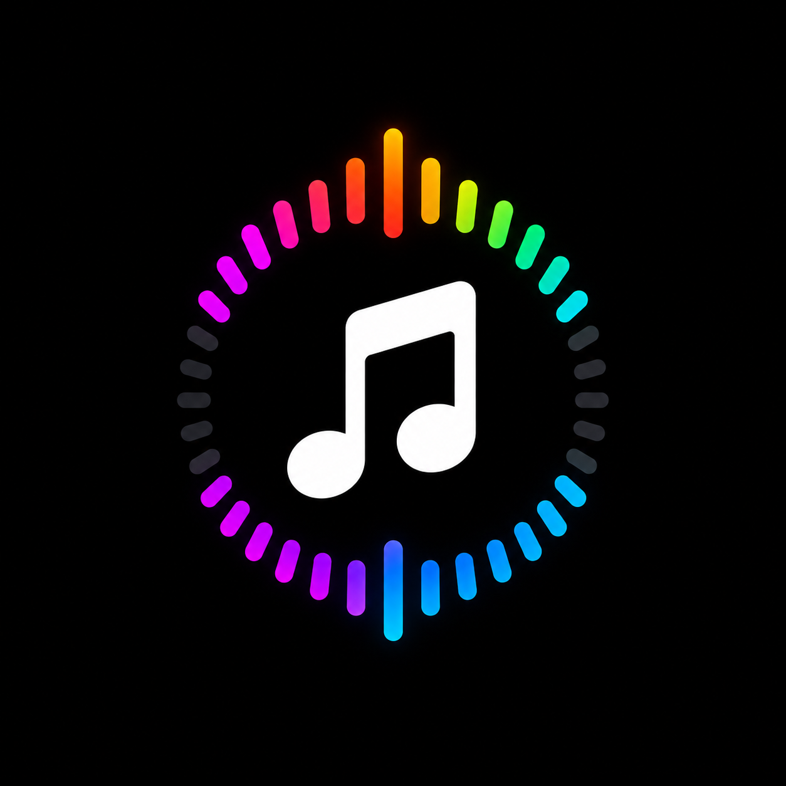
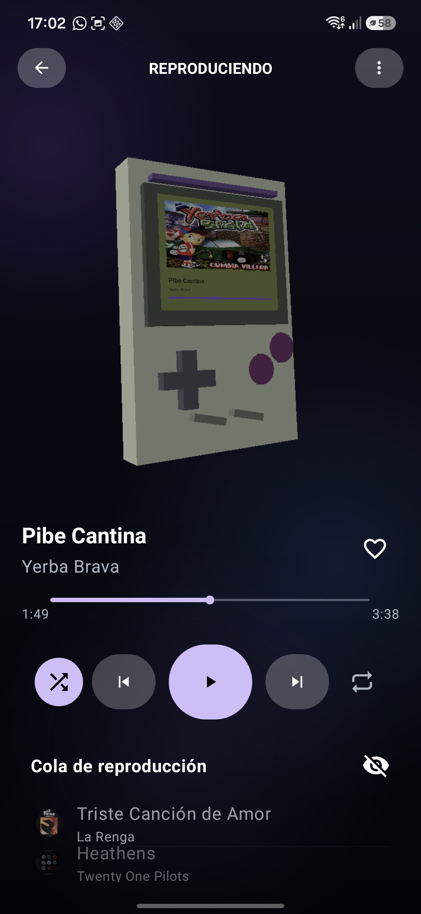
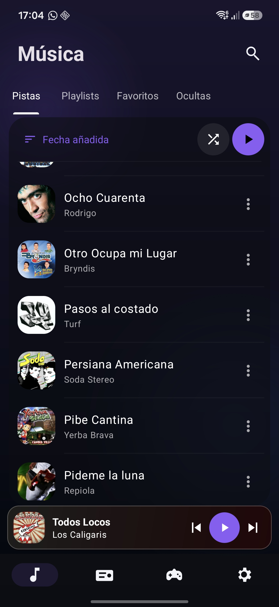
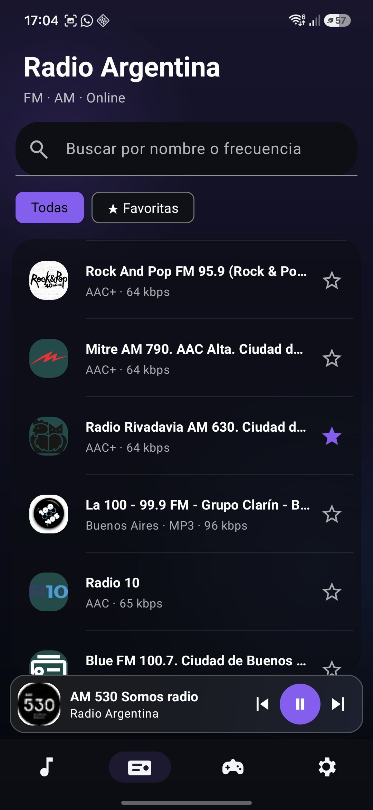
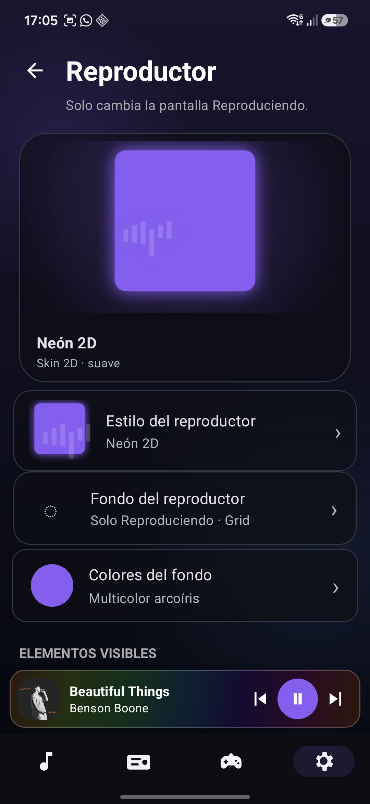
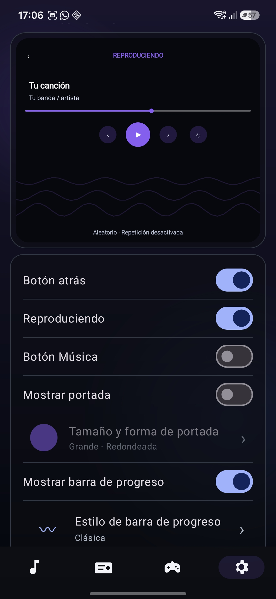
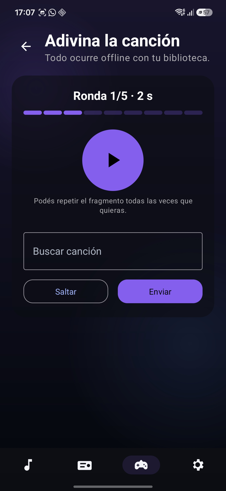

<div align="center">



# Nebula

### Tu música. Tu reproductor. Tus reglas.

Un reproductor de música para Android pensado para escuchar tu biblioteca local **sin cuentas, sin suscripciones y sin depender de internet**.  
Radio online, skins, visualizadores, colores, playlists, juegos y una cantidad poco razonable de opciones de personalización.

[](https://github.com/ezepalleros/Nebula-app-/releases/latest)
[](#requisitos)
[](#tecnología)
[](https://github.com/ezepalleros/Nebula-app-/stargazers)

**[⬇️ Descargar la última versión](https://github.com/ezepalleros/Nebula-app-/releases/latest)**

</div>

---

## ✨ Qué es Nebula

Nebula nació porque quería un reproductor que pudiera adaptar a mi gusto en vez de adaptarme yo al reproductor.

La música local es la protagonista: la app lee tu biblioteca desde Android, funciona offline y mantiene la reproducción en segundo plano. La única parte que necesita conexión es la radio y, cuando corresponda, funciones opcionales que consulten contenido online.

<table>
<tr>
<td width="50%"><b>🎵 Biblioteca local</b><br>Escuchá la música guardada en tu dispositivo, con portadas, favoritos, playlists, filtros de carpetas y control sobre qué contenido aparece.</td>
<td width="50%"><b>🎨 Un reproductor realmente personalizable</b><br>Skins 2D y 3D, visualizadores, formas de portada, tipografías, fondos, degradados, colores dinámicos y elementos de la pantalla que podés mostrar u ocultar.</td>
</tr>
<tr>
<td><b>🔥 Reproducción cuidada</b><br>Crossfade, gapless, normalización de volumen, historial de aleatorio, controles externos y cola de reproducción.</td>
<td><b>📻 Radio integrada</b><br>Emisoras online, búsqueda y favoritos sin mezclar la lógica de la radio con tu biblioteca local.</td>
</tr>
<tr>
<td><b>🔋 Pensada para el teléfono</b><br>Modo súper ahorro y reducción de efectos costosos cuando no hacen falta.</td>
<td><b>🎮 Porque escuchar música no era suficiente</b><br>Incluye juegos como <i>Adivina la canción</i> y <i>El intruso</i> usando tu propia biblioteca.</td>
</tr>
</table>

---

## 🎧 Reproduciendo

La pantalla de reproducción puede ser sobria, llamativa o directamente innecesariamente personalizada.

<table>
<tr>
<td align="center" width="33%">
<br>
<b>Reproductor clásico</b>
</td>
<td align="center" width="33%">
<br>
<b>Skins 3D</b>
</td>
<td align="center" width="33%">
<br>
<b>Visualizadores</b>
</td>
</tr>
</table>

### Lo que podés cambiar

- Skins 2D y 3D.
- Visualizadores reactivos como **Anillo** y **Ecualizador 2D**.
- Portada cuadrada, redondeada o circular.
- Fondos sólidos, degradados, multicolor o derivados de la portada.
- Colores del reproductor y del mini reproductor.
- Tipografía y animaciones.
- Estilos de barra de progreso, incluso con emoji personalizado.
- Elementos visibles de la pantalla de reproducción.
- Cola integrada debajo de los controles.
- Gestos sobre la portada para cambiar de canción.

---

## 📚 Tu biblioteca, sin vueltas

<table>
<tr>
<td width="48%" align="center">

</td>
<td width="52%">

### Música local primero

Nebula trabaja con la biblioteca de Android mediante MediaStore.

- Canciones, álbumes, artistas y agrupaciones.
- Favoritos.
- Playlists propias.
- Orden y aleatorio configurables.
- Ocultar carpetas completas de la biblioteca.
- Opción para ocultar audios de WhatsApp.
- Mini reproductor persistente.
- Editor de metadatos.

Tu música sigue siendo tuya: no hace falta iniciar sesión para escucharla.

</td>
</tr>
</table>

---

## 📻 Radio

<table>
<tr>
<td width="52%">

Radio online integrada dentro de Nebula, pero separada de la reproducción de canciones locales.

- Búsqueda de emisoras.
- Favoritos de radio.
- Controles desde notificación, Bluetooth y pantalla de bloqueo.
- Reproducción en segundo plano.
- Contador de emisoras opcional.

> La biblioteca local funciona offline. La radio, naturalmente, necesita conexión a internet.

</td>
<td width="48%" align="center">

</td>
</tr>
</table>

---

## 🎨 Personalización

Si una opción visual se puede convertir en un ajuste, probablemente Nebula ya lo intentó.

<table>
<tr>
<td align="center" width="50%">
<br>
<b>Skins, fondos y colores</b>
</td>
<td align="center" width="50%">
<br>
<b>Elegí qué querés ver</b>
</td>
</tr>
</table>

La configuración está dividida por categorías para que no sea necesario sobrevivir a una pantalla infinita de switches:

**Apariencia · Navegación · Reproductor · Audio · Radio · Biblioteca · Batería · Información**

---

## 🎮 Adivina la canción

<div align="center">

</div>

Nebula también usa tu biblioteca para pequeños juegos musicales. En **Adivina la canción** escuchás fragmentos y tratás de reconocer el tema antes de necesitar más tiempo.

Todo ocurre con la música que ya tenés en el dispositivo.

---

## 🔊 Audio y reproducción

Nebula usa **Media3 / ExoPlayer** y un motor de reproducción con dos players para gestionar transiciones.

Entre las opciones disponibles:

- Crossfade configurable.
- Gapless.
- Fade opcional al pausar/reanudar.
- Normalización de volumen.
- Aleatorio con historial real: `Anterior` vuelve por lo que efectivamente escuchaste.
- Repetir canción / lista.
- Cola de reproducción con acceso directo a cualquier canción.
- Controles desde notificación, Bluetooth y pantalla de bloqueo.
- Opción tipo Samsung Music para el comportamiento del botón `Anterior`.

---

## 🚀 Instalación

1. Entrá en **[Releases](https://github.com/ezepalleros/Nebula-app-/releases/latest)**.
2. Descargá el APK de la última versión.
3. Abrilo en tu teléfono.
4. Si Android lo solicita, permití la instalación desde esa fuente.
5. Al abrir Nebula por primera vez, concedé acceso a tu música y a las notificaciones.

### Requisitos

- **Android 8.0 (API 26) o superior**.
- Permiso para acceder a archivos de audio.
- Permiso de notificaciones en versiones de Android que lo requieren.
- Internet únicamente para radio y funciones online opcionales.

---

## 🛠️ Tecnología

Nebula está hecha de forma nativa para Android.

| Componente | Tecnología |
|---|---|
| Lenguaje | Java |
| Interfaz | XML Views |
| Audio | AndroidX Media3 / ExoPlayer |
| Biblioteca | MediaStore |
| Datos locales | Room |
| Reproducción externa | MediaSession |
| Skins especiales | Canvas / WebView / JavaScript |
| SDK mínimo | 26 |
| Target SDK | 35 |

No usa Jetpack Compose.

---

## 🧑‍💻 Compilar desde el código fuente

```bash
git clone https://github.com/ezepalleros/Nebula-app-.git
cd Nebula-app-
```

Después abrí la carpeta del proyecto en Android Studio y sincronizá Gradle.

Para generar un APK firmado de release usá:

**Build → Generate Signed App Bundle or APK → APK**

---

## 🔄 Actualizaciones

Nebula puede consultar la última versión publicada en **GitHub Releases** desde la sección **Información** de la app.

Si existe una versión más nueva, te lleva a la release oficial para descargarla. Android sigue mostrando sus controles normales de seguridad e instalación.

**[Ver todas las releases →](https://github.com/ezepalleros/Nebula-app-/releases)**

---

## ❤️ Apoyar el proyecto

Si Nebula te sirve y querés bancar el desarrollo:

| | |
|---|---|
| **Alias** | `eze.palleros` |
| **CVU** | `0000003100067543622083` |
| **Nombre** | Ezequiel German Palleros Ibarra |

No hace falta donar para usar ninguna función de Nebula.

---

## 🤝 Contribuir

Issues, reportes de bugs e ideas son bienvenidos.

Si encontrás algo roto, idealmente incluí:

- modelo del teléfono
- versión de Android
- pasos para reproducir el problema
- captura o video si es un bug visual

**[Abrir un issue](https://github.com/ezepalleros/Nebula-app-/issues/new)**

---

## 👤 Créditos

**Desarrollado por [elequiweb](https://github.com/ezepalleros).**

Nebula es un proyecto independiente para Android.

<div align="center">

### 🌌 Nebula

**Poné play. El resto lo decidís vos.**

[Descargar](https://github.com/ezepalleros/Nebula-app-/releases/latest) · [Código fuente](https://github.com/ezepalleros/Nebula-app-) · [Reportar un problema](https://github.com/ezepalleros/Nebula-app-/issues)

</div>
